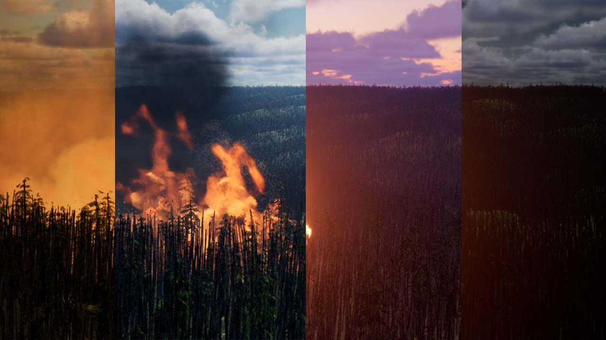
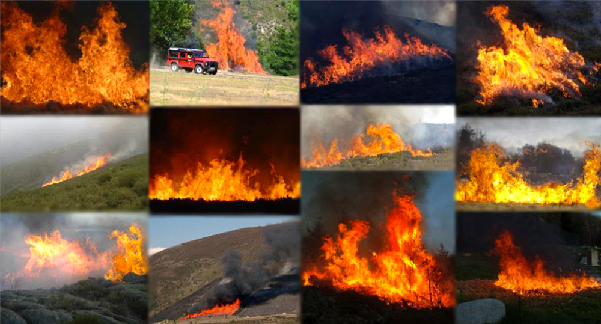
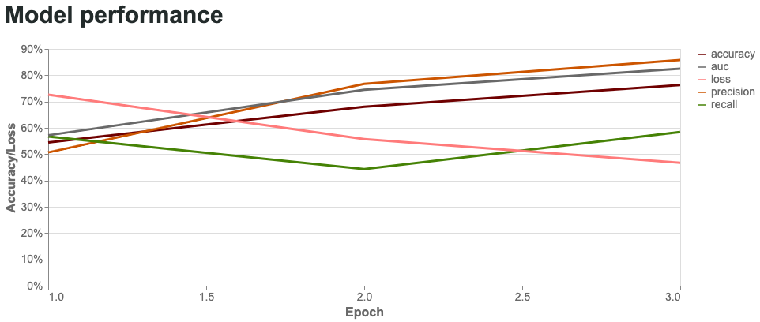

# Detecting Wildfires with Image Recognition and Image Segmentation Generated Through Game Engine


[View the website with a live model.](https://logantcrawford.github.io/wildfire-detection-system/)

[View the full paper.](https://docs.google.com/document/d/1KL5m8Rhk-LxnvMVKsS_5K8OEObJSrm4m_Zfzep6vTIA/edit?usp=sharing)

[View all of the videos talking about the development.](https://www.youtube.com/channel/UCe0wpBbdf6sOYOtreRF5eOQ/videos)
## Protecting the Forest.
In recent years, climate change has facilitated an inexcusable influx of large-scale droughts and lengthy fire seasons across the globe. Disturbingly the dramatic increase in wildfires has devastated communities and natural beauty. In California, during the record drought conditions of 2014, Fire Safe Marin, Pacific Gas and Electric Company (PG&E), and Marin County Fire Department collaborated to install Marin’s remote wildfire detection system. One of the first systems served to assist firefighters in identifying new wildfire locations. Since then, the operations had expanded in 2017. The Geographic community has pressured local and federal governments to implement human-monitored camera systems to detect forest fires.

While there is a wide range of methods in monitoring forests, only recently have methods of virtual segmentation datasets for image recognition that can realistically simulate large-scale tree canopies been available. This research avenue has expanded due to advancements in real-time rendering through advanced graphics cards capable of light particle simulation with ray tracing and virtual geometry systems such as Nanite available through Unreal Engine 5. Together these methods provide a realistic environment virtually that can replace the needs for real-life image data collection.
## UE5 Documentation Description
Using Unreal Engine for dataset generation can be plug-and-play with Blueprints and landscape procedural generation. Though there is significant research and design in generating accurate data, the core methods are simplistic. They are essentially teleporting a first-person controller around the map to take screenshots of the landscape to create a robust dataset.

Though for this project, we needed variation in the environment. We used a plugin for Unreal Engine called Sky Creator that could dynamically change the time of day and cloud coverage. By creating small datasets of minor variations with these differing conditions, we combined them into a large dataset that represents the landscape with typical cloud coverages and lighting conditions. 


The dataset we created is a 35 x 35 kilometers map based on real-life topography outside Nimrod, Oregon, in the Willamette National Forest. Known for their beautiful dense Douglass Fir forests, these forests can easily be replicated in-game through procedural generation by creating parameters between various assets. Though processing power is a limiting factor, using Unreal console commands can help get clear screenshots. 

Of course, not every landscape looks like the one we generated. But that is precisely the reason we chose to use Unreal Engine to create a custom dataset. Suppose we included another geographic area like the Western Rocky Mountains or the Australian Bush. In that case, we can get real-life topography and use procedural generation precisely like I did to populate the landscape with foliage. 

For more information on how this dataset was created [view the full paper.](https://docs.google.com/document/d/1KL5m8Rhk-LxnvMVKsS_5K8OEObJSrm4m_Zfzep6vTIA/edit?usp=sharing)
### Loading Unreal Engine Map
All of the Unreal Engine files can be found in the [Unreal Engine Folder](unreal/)

There are plugin dependencies that must be fulfilled:
- [Fir Forest by Dave Berg](https://www.unrealengine.com/marketplace/en-US/product/fir-forest)
- [Sky Creator by Dmitry Karpukhin](https://www.unrealengine.com/marketplace/en-US/product/sky-creator)
- [Volcano Eruptions by one.studio2](https://www.unrealengine.com/marketplace/en-US/product/volcano-pack)

## Corsican Database
To test the performance of our model we have utilized the Corsican Wildfire Database from "Computer vision for wildfire research: an evolving image dataset for processing and analysis” which is one of the largest of its kind. This database exclusively contained images including fire, thus we sought images without fire from other locations. Included in the dataset are pictures and image sequences acquired om the visible and near-infrared areas in various shooting conditions, type of burning vegetation, climatic conditions, brightness, and distance to fire. 



- Read [Computer vision for wildfire research: An evolving image dataset for processing and analysis](https://www.sciencedirect.com/science/article/pii/S0379711217302114)
- View [Corsican dataset website](http://cfdb.univ-corse.fr/index.php?menu=1)

## Downloading the Data
To download a sample set of the data use the pickle files found in the wildfire_prediction_pipline/artifacts folder: 

```
import pickle
dir = os.getcwd()

with open('{}/artifacts/{}'.format(dir, 'train_images_unrealEvenish_pkl.pkl'), 'rb') as pickle_file: #train_images_pkl_all.pkl
    train_data = pickle.load(pickle_file)

with open('{}/artifacts/{}'.format(dir, 'test_images_pkl_uneven_w_drone.pkl'), 'rb') as pickle_file: #test_images_pkl_even_ratio.pkl
    test_data = pickle.load(pickle_file)
```

This will load two separate datasets. The first is a sample of the unreal images used for training the model as well as a test set of drone and fire images. 

## Model Requirements and Installation
Prior to running the model please install and set up the project dependencies utilizing the requirements .txt file. 

```
pip install -r requirements.txt
```

## Model Exploration Jupyter Notebook

For setting up the model, utilize the model exploration notebook, which will load in the images, transform and run the model. For the model, one can change different hyperparams of the models in the "Model Creation" section (epochs, num_units, dropout_rate and optimizer to evaluate it's effects on the model performance metrics. 

Sample model peformence visualizaitons: 




## Website setup Instructions
To view the website the Github Pages with a live TensorFlow model can be viewed here. [viewed here](https://logantcrawford.github.io/wildfire-detection-system/)

Train a Keras classifier and save its weights
Install `tensorflowjs` Python Library
```
pip install tensorflowjs
```
Use tensorflowjs conversion tool to modify h5 weights to Javascript format. This returns `.bin` and `.json` files. Ensure these files are located inside of the static folder.
```
tensorflowjs_converter --input_format=keras ./model.h5 ./jsweights
```
Run a local server, this can be done with any preferred method. Visual Studio Code Live Server extension and Python are both easy options.
```
python3 -m http.server
```
Live Server automatically opens a new tab in the default browser, for Python, navigate to [localhost](http://127.0.0.1:8000/)


